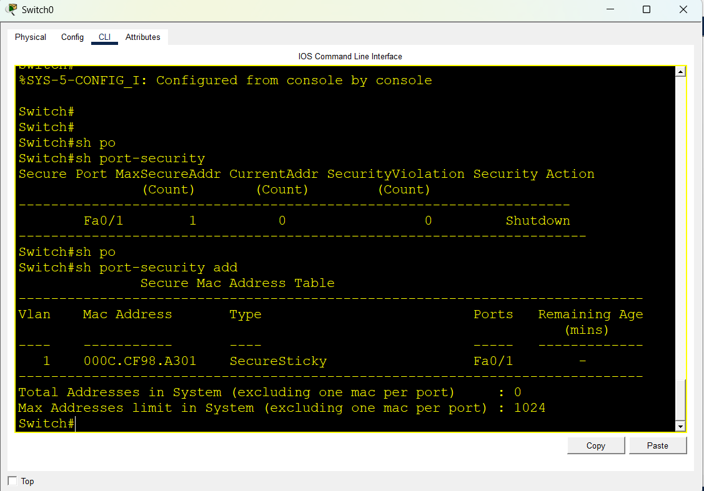
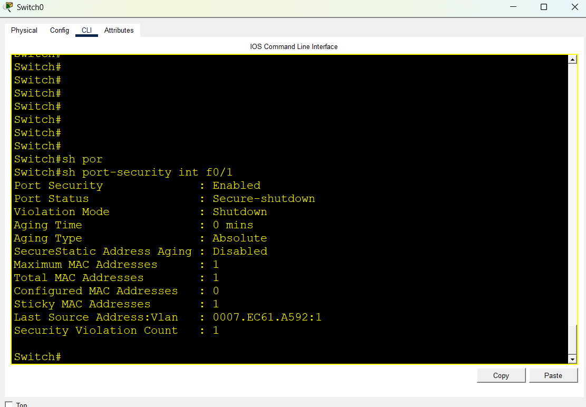

# Lab 07: Switch Port Security (Sticky MAC & Violation Shutdown)

## Objective
Configure switch port security on a Cisco Catalyst switch to restrict access on port `FastEthernet0/1` to a single authorized device using Sticky MAC addressing. Verify that connecting an unauthorized device triggers a security violation and places the port into `Secure-shutdown` (err-disabled) state.

## Topology
- 1 Cisco Catalyst 2960 Switch
- 1 Authorized PC (PC0)
- 1 Unauthorized / Rogue PC (PC1)
- Copper Straight-Through Cables

## IP Addressing Plan

| Device | Interface | IP Address | Subnet Mask | Status |
|---|---|---|---|---|
| PC0 | FastEthernet0 | 192.168.1.10 | 255.255.255.0 | Authorized Device |
| PC1 | FastEthernet0 | 192.168.1.20 | 255.255.255.0 | Unauthorized Device |

---

## Switch Configuration

### 1. Enable Port Security with Sticky MAC
```text
enable
configure terminal

interface fastEthernet 0/1
 switchport mode access
 switchport port-security
 switchport port-security maximum 1
 switchport port-security mac-address sticky
 switchport port-security violation shutdown
 no shutdown
 exit

end
write memory
```

---

## Verification & Testing

### 1. Verify Authorized MAC Address Learning
After PC0 connects and sends initial traffic, the switch dynamically learns and saves its MAC address:

```text
Switch# show port-security interface fastEthernet 0/1
Switch# show port-security address
```

### 2. Triggering Security Violation
1. Disconnected PC0 from port `FastEthernet0/1`.
2. Connected unauthorized PC1 to the same port `FastEthernet0/1`.
3. Sent traffic from PC1.
4. The switch detected the MAC address mismatch, triggered a violation, and changed the port status to `Secure-shutdown`.

```text
Switch# show port-security interface fastEthernet 0/1
Port Security              : Enabled
Port Status                : Secure-shutdown
Violation Mode             : Shutdown
Aging Time                 : 0 mins
Aging Type                 : Absolute
SecureStatic Address Aging : Disabled
Maximum MAC Addresses      : 1
Total MAC Addresses        : 1
Configured MAC Addresses   : 0
Sticky MAC Addresses       : 1
Last Source Address:Vlan   : <PC1-MAC-Address>:1
Security Violation Count   : 1
```

### 3. Port Recovery Steps
To recover the port after resolving the security issue:
```text
configure terminal
interface fastEthernet 0/1
 shutdown
 no shutdown
end
```

---

## Evidence / Screenshots

### 1. Topology


### 2. Sticky MAC Learned


### 3. Security Violation & Shutdown


---

## Learning Outcomes
- Implemented Layer-2 switch port security.
- Learned how Sticky MAC dynamically binds hardware addresses to specific switch ports.
- Observed the `Shutdown` violation mode putting an interface into `err-disabled`/`Secure-shutdown`.
- Practiced the recovery process using `shutdown` and `no shutdown` commands.

## Files
- `port-security.pkt` — Cisco Packet Tracer Lab File
- `topology.png` — Network layout screenshot
- `sticky-mac-learned.png` — Sticky MAC table verification
- `violation-shutdown.png` — Port security violation output
