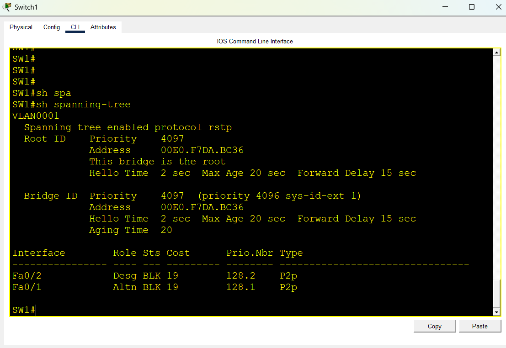
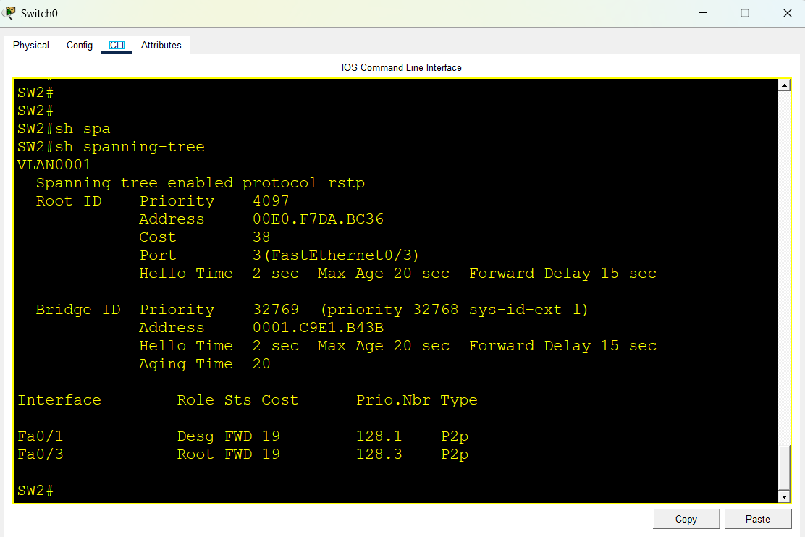

# Lab 08: Spanning Tree Protocol (STP & Rapid-PVST+)

## Objective
Implement Spanning Tree Protocol (STP) across a redundant Layer-2 triangle switch topology. Observe loop prevention (blocking port), configure a deterministic Root Bridge by lowering bridge priority, and enable Rapid-PVST+ for fast network convergence.

## Topology
- 3 Cisco Catalyst 2960 Switches (SW1, SW2, SW3)
- Inter-switch redundant links creating a physical loop

## Port & Interconnection Plan

| Link | Switch 1 Port | Switch 2 Port | Link Type |
|---|---|---|---|
| SW1 ↔ SW2 | SW1 FastEthernet0/1 | SW2 FastEthernet0/1 | Trunk / Inter-switch |
| SW1 ↔ SW3 | SW1 FastEthernet0/2 | SW3 FastEthernet0/2 | Trunk / Inter-switch |
| SW2 ↔ SW3 | SW2 FastEthernet0/3 | SW3 FastEthernet0/3 | Redundant Loop Link |

---

## Bridge Priority Configuration

| Switch | Role | Priority Value | STP Mode |
|---|---|---|---|
| SW1 | Root Bridge (Primary) | 4096 | Rapid-PVST+ |
| SW2 | Non-Root Bridge | 32768 (Default) | Rapid-PVST+ |
| SW3 | Non-Root Bridge | 32768 (Default) | Rapid-PVST+ |

---

## Switch Configurations

### 1. SW1 (Root Bridge Configuration)
```text
enable
configure terminal
hostname SW1
spanning-tree mode rapid-pvst
spanning-tree vlan 1 priority 4096
end
write memory
```

### 2. SW2 & SW3 (Non-Root Configuration)
```text
enable
configure terminal
spanning-tree mode rapid-pvst
end
write memory
```

---

## Verification & Commands

### 1. Root Bridge Verification (SW1)
```text
SW1# show spanning-tree
```
Expected Output:
- Displays `This bridge is the root`.
- All active connected ports (Fa0/1, Fa0/2) are in `Designated` role with `Forwarding (FWD)` status.

### 2. Non-Root Port State Verification (SW2 / SW3)
```text
SW2# show spanning-tree
SW3# show spanning-tree
```
Expected Output:
- Identifies Root Port (pointing towards SW1).
- Places one redundant link into `Alternate / Blocking (BLK)` state to prevent Layer-2 broadcast storms.

---

## Evidence / Screenshots

### 1. Topology


### 2. SW1 Root Bridge Output


### 3. Non-Root Switch Blocked Port


---

## Learning Outcomes
- Understood the importance of STP in preventing Layer-2 loops and broadcast storms.
- Learned how Root Bridge election occurs using Bridge ID (Priority + MAC address).
- Configured manual Root Bridge election using `spanning-tree vlan 1 priority 4096`.
- Verified port roles (`Root`, `Designated`, `Alternate/Blocked`).
- Enabled Rapid-PVST+ (`802.1w`) for faster convergence.

## Files
- `stp-rstp.pkt` — Cisco Packet Tracer Lab File
- `topology.png` — Redundant loop topology screenshot
- `sw1-root-bridge.png` — Root bridge verification output
- `sw-blocked-port.png` — Alternate/blocking port verification output
