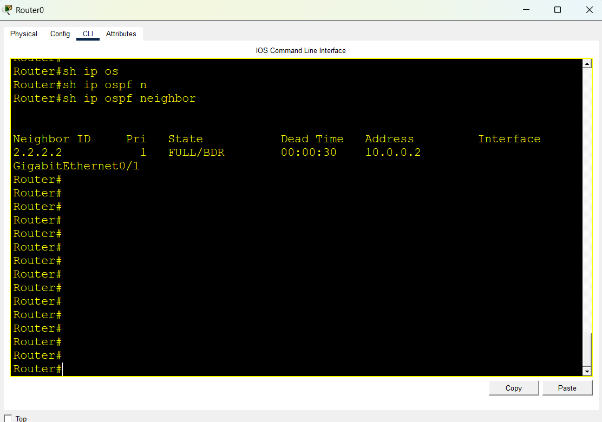
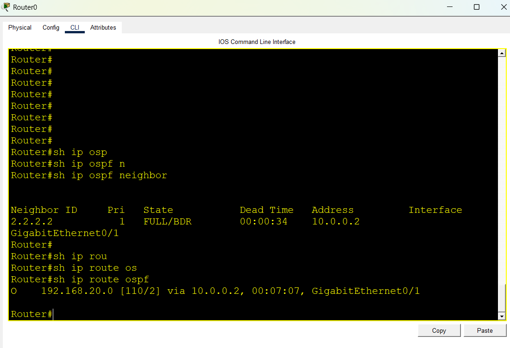

# Lab 10: OSPFv2 Single-Area Dynamic Routing (Area 0)

## Objective
Configure single-area OSPFv2 (Backbone Area 0) across two Cisco routers to dynamically exchange routing information. Verify neighbor adjacency formation, OSPF route injection into the routing table, and end-to-end IP reachability.

## Topology
- 2 Cisco Routers (R1, R2)
- 2 Cisco Catalyst 2960 Switches (SW1, SW2)
- 4 PCs (PC0, PC1, PC2, PC3)
- OSPF Area 0 backbone spanning both LANs and point-to-point /30 WAN link

## IP & OSPF Parameter Plan

| Device | Interface | IP Address | Subnet Mask | Wildcard Mask | OSPF Area | Router ID |
|---|---|---|---|---|---|---|
| R1 | GigabitEthernet0/0 | 192.168.10.1 | 255.255.255.0 | 0.0.0.255 | Area 0 | 1.1.1.1 |
| R1 | GigabitEthernet0/1 | 10.0.0.1 | 255.255.255.252 | 0.0.0.3 | Area 0 | 1.1.1.1 |
| R2 | GigabitEthernet0/1 | 10.0.0.2 | 255.255.255.252 | 0.0.0.3 | Area 0 | 2.2.2.2 |
| R2 | GigabitEthernet0/0 | 192.168.20.1 | 255.255.255.0 | 0.0.0.255 | Area 0 | 2.2.2.2 |

---

## Router Configurations

### 1. Router 1 (R1)
```text
enable
configure terminal
hostname R1

interface gigabitEthernet 0/0
 ip address 192.168.10.1 255.255.255.0
 no shutdown
 exit

interface gigabitEthernet 0/1
 ip address 10.0.0.1 255.255.255.252
 no shutdown
 exit

router ospf 1
 router-id 1.1.1.1
 network 192.168.10.0 0.0.0.255 area 0
 network 10.0.0.0 0.0.0.3 area 0
 exit

end
write memory
```

### 2. Router 2 (R2)
```text
enable
configure terminal
hostname R2

interface gigabitEthernet 0/0
 ip address 192.168.20.1 255.255.255.0
 no shutdown
 exit

interface gigabitEthernet 0/1
 ip address 10.0.0.2 255.255.255.252
 no shutdown
 exit

router ospf 1
 router-id 2.2.2.2
 network 192.168.20.0 0.0.0.255 area 0
 network 10.0.0.0 0.0.0.3 area 0
 exit

end
write memory
```

---

## Verification & Commands

### 1. OSPF Neighbor Adjacency
```text
R1# show ip ospf neighbor
```
Expected output: Neighbor ID `2.2.2.2` in `FULL` state across interface `G0/1`.

### 2. OSPF Route Verification
```text
R1# show ip route ospf
```
Expected output: Dynamically learned route `O 192.168.20.0/24 [110/...]` via `10.0.0.2`.

### 3. End-to-End Connectivity
From PC0:
```text
ping 192.168.20.10
```
Verified full reachability with 0% packet loss.

---

## Evidence / Screenshots

### 1. Topology


### 2. OSPF Neighbor Adjacency


### 3. OSPF Dynamic Routes


### 4. End-to-End Ping Test


---

## Learning Outcomes
- Configured OSPFv2 single-area dynamic routing protocol.
- Understood the calculation and use of Wildcard Masks (`255.255.255.255 - Subnet Mask`).
- Configured manual 32-bit `router-id` for deterministic neighbor identification.
- Verified neighbor adjacency formation states (`INIT` -> `2-WAY` -> `EXSTART` -> `EXCHANGE` -> `LOADING` -> `FULL`).
- Verified OSPF administrative distance (`AD = 110`) in the Cisco IOS routing table.

## Files
- `ospf-single-area.pkt` — Cisco Packet Tracer Lab File
- `topology.png` — Network topology screenshot
- `ospf-neighbor.png` — OSPF neighbor table output
- `ospf-routes.png` — OSPF learned routes output
- `ping-test.png` — End-to-end connectivity test
